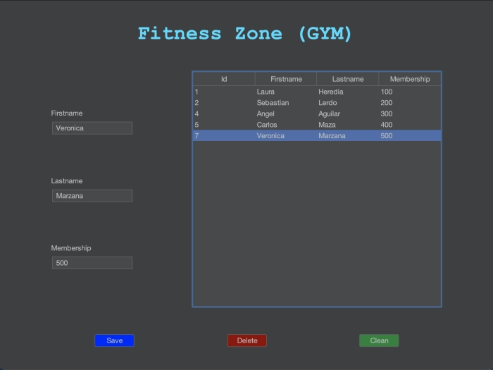

# Fitness Zone (GYM)
A Java GUI desktop application integrated with Spring and MySQL for user information management, designed to support RESTful API principles.

## Description
This project is a desktop application developed using Java Swing for the graphical user interface (GUI). It allows users to manage membership details such as first name, last name, and membership number. The backend is powered by the Spring Framework and connected to a MySQL database. The application is also built to be RESTful API-compliant, allowing for easy integration with other applications or services.

With Swing, the application provides a simple and intuitive interface for managing user data, displaying all necessary operations like adding, updating, and deleting users.

## Technologies Used
- **Java Swing for GUI** (Graphical User Interface)
    - Swing is a part of the Java Foundation Classes (JFC) and is used to create window-based applications. In this project, Swing is used to build forms for user data entry and display.
- **Spring Boot** for backend development
- **MySQL** for database management.
- **RESTful API** principles for communication between client and server

## Features
- Graphical User Interface (GUI) built with **Java Swing**.
- Backend powered by the **Spring Framework**.
- **MySQL** for database management.
- Fully **RESTful** API-compliant for easy integration.
- Complete **CRUD** operations: create, read, update, and delete user data.
- User-friendly design for ease of use.

## Main GUI window (data entry screen).

## Architecture Diagram

The following diagram illustrates the architecture of the **Fitness Zone (GYM)** application:

- **Presentation Layer (Swing GUI)**: This layer uses **Java Swing** to build the graphical user interface (GUI). It handles user input and displays the results from the backend.
- **Service Layer (Spring Boot)**: This layer contains the business logic and interacts with the **Repository** layer to handle data operations and processing.
- **Repository Layer (Spring Data JPA)**: Manages data persistence with **Spring Data JPA**. It acts as an intermediary between the service layer and the database, handling CRUD operations.
- **Entity Layer**: Represents the data model. The entities are annotated classes that map the database tables using **JPA annotations**. Examples include `@Entity`, `@Table`, `@Column`, and `@Id`.
- **Database (MySQL)**: The relational database where user data is stored.

### Architecture Diagram

Below is the architecture diagram of the application:

## Contributions
Contributions are welcome. If you find a bug or have a suggestion, please open an issue or submit a pull request.

## License
This project is licensed under the MIT License.